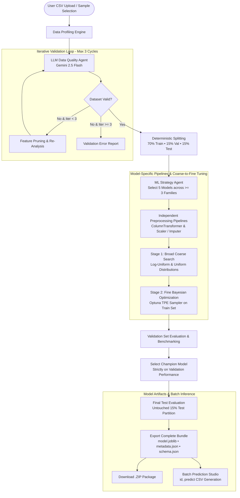

# ML Automation Agent

An end-to-end automated Machine Learning system combining **LLM-driven Data Science reasoning (Gemini 2.5 Flash via LangChain)**, **LangGraph cyclical state orchestration**, **model-specific scikit-learn pipelines**, **two-stage coarse-to-fine Bayesian hyperparameter optimization**, and a **modern React frontend**.

---

## 1. System Architecture



---

## 2. Key Capabilities & Engineering Highlights

* **Cyclical Validation Guardrails**: LangGraph-orchestrated validation loop (up to 3 iterations) detecting target leakage, zero-variance columns, ID identifiers, extreme missingness, and class imbalance.
* **Strict Leakage Prevention**:
  * The untouched 15% test partition is strictly isolated until final verification.
  * Model selection uses validation metrics only.
  * Preprocessing transformers (`SimpleImputer`, `RobustScaler`, `OneHotEncoder`, etc.) are fitted strictly on training subsets.
* **Model-Specific Preprocessing**: Tree-based estimators bypass scaling to retain discrete split points, while linear, distance, and kernel estimators receive robust scaling and one-hot encoding.
* **Two-Stage Coarse-to-Fine Hyperparameter Search**:
  * **Stage 1 (Coarse)**: Broad search across logarithmic scales (`learning_rate`, `C`, `alpha`) and linear bounds.
  * **Stage 2 (Fine)**: Bayesian Optimization with Optuna's TPE Sampler, focusing directly on the refined bounds around coarse winners.
* **Production Artifact Bundling**: Saves `model.joblib` containing the combined `ColumnTransformer` + estimator, `metadata.json`, and `feature_schema.json`.
* **Zero-Refit Batch Inference**: Upload any unlabeled CSV to generate formatted `id,predict` CSVs instantly.

---

## 3. Installation & Setup

All backend ML execution must run inside the predefined Conda environment: `ml-env`.

### 1. Activate Environment & Install Dependencies

```bash
# Activate the predefined conda environment
conda activate ml-env

# Install backend dependencies
pip install -r requirements.txt

# Install frontend dependencies
cd frontend
npm install
cd ..
```

### 2. Environment Variables

Configure your Gemini API key (optional — if omitted, the system seamlessly runs on deterministic Senior Data Scientist heuristics):

```bash
export GEMINI_API_KEY="your-gemini-api-key-here"
export LLM_MODEL="gemini-2.5-flash"
```

*(You can also configure or update your API key directly within the React UI).*

---

## 4. Running the System

### Option A: Using Convenience Scripts

Start the backend in one terminal:
```bash
./scripts/start_backend.sh
```

Start the frontend in another terminal:
```bash
./scripts/start_frontend.sh
```

### Option B: Manual Execution

**Backend (FastAPI on Port 8000):**
```bash
conda activate ml-env
export PYTHONPATH=.
python -m backend.app.main
```

**Frontend (React Vite on Port 5173):**
```bash
cd frontend
npm run dev -- --host 0.0.0.0 --port 5173
```

Open your browser at `http://localhost:5173`.

---

## 5. Running the Test Suite

Execute the test suite verifying profiling, agents, coarse-to-fine optimization, serialization, inference, and end-to-end LangGraph execution:

```bash
conda activate ml-env
PYTHONPATH=. pytest backend/tests/test_backend.py -v
```

---

## 6. End-to-End Walkthrough Example

1. **Open Studio**: Navigate to `http://localhost:5173`.
2. **Select Sample Dataset**: Click **"Load Dataset"** on the *Customer Churn Prediction* card (or upload your own CSV).
3. **Configure Targets & Features**: Select `churn` as the target variable (Y). Candidate features (X) are automatically selected.
4. **Initiate Pipeline**: Click **"Run Automated ML Pipeline"**.
5. **Observability**:
   * Watch the **Data Quality Agent** audit features and prune ID columns.
   * View the **ML Strategy Agent** select 5 candidate models across at least 3 distinct families (`tree_ensemble`, `gradient_boosting`, `linear`, `support_vector`, `neighbors`).
   * Watch **Coarse-to-Fine Bayesian Optimization** tune hyperparameters in real time.
   * Inspect the **Candidate Model Comparison Table** and **Validation Champion**.
   * Review the **Final Test Evaluation** on the untouched 15% test partition.
6. **Deploy & Predict**:
   * Click **"Download Model Package"** to download the complete pipeline ZIP.
   * In the **Batch Prediction Studio**, upload `data/churn_unlabeled.csv` to generate predictions and download the output `id,predict` CSV.

---

## 7. Project Structure

```text
ml-automation-agent/
│
├── backend/
│   ├── app/
│   │   ├── main.py                     # FastAPI entry point & CORS
│   │   ├── api/
│   │   │   └── endpoints.py            # Upload, stream, session, prediction routes
│   │   ├── agents/
│   │   │   ├── llm_client.py           # Gemini 2.5 Flash via LangChain
│   │   │   ├── data_quality_agent.py   # Leakage & hygiene audit
│   │   │   ├── feature_selection_agent.py # Feature filtering
│   │   │   ├── ml_strategy_agent.py    # 5 models across >= 3 families
│   │   │   ├── hyperparameter_agent.py # Log-uniform & uniform search bounds
│   │   │   └── report_agent.py         # Test vs Validation reporting
│   │   ├── graph/
│   │   │   └── workflow.py             # LangGraph state machine & validation loop
│   │   ├── core/
│   │   │   └── config.py               # Centralized hyperparameters & paths
│   │   ├── schemas/
│   │   │   └── ml_schemas.py           # Strict Pydantic agent schemas
│   │   ├── models/
│   │   │   └── model_factory.py        # Estimator instantiation & seeds
│   │   ├── preprocessing/
│   │   │   └── pipeline_builder.py     # Model-specific ColumnTransformers
│   │   ├── optimization/
│   │   │   └── optimizer.py            # Coarse & Fine Bayesian search
│   │   ├── evaluation/
│   │   │   └── evaluator.py            # Classification & regression metrics
│   │   ├── visualization/
│   │   │   └── plots.py                # Matplotlib base64 visualizer
│   │   └── services/
│   │       ├── profiler.py             # Statistical dataset profiler
│   │       ├── artifact_manager.py     # Pipeline serialization & packaging
│   │       └── inference.py            # Zero-refit batch inference
│   │
│   ├── templates/                      # Predefined trusted preprocessing templates
│   │   ├── numerical/
│   │   ├── categorical/
│   │   └── missing/
│   ├── artifacts/                      # Saved models & metadata
│   └── tests/
│       └── test_backend.py             # Comprehensive test suite
│
├── frontend/
│   ├── src/
│   │   ├── components/                 # React UI components
│   │   │   ├── Sidebar.jsx
│   │   │   ├── Header.jsx
│   │   │   ├── UploadSection.jsx
│   │   │   ├── DatasetPreviewSection.jsx
│   │   │   ├── DataQualitySection.jsx
│   │   │   ├── MLStrategySection.jsx
│   │   │   ├── TrainingProgressSection.jsx
│   │   │   ├── ValidationComparisonSection.jsx
│   │   │   ├── FinalTestEvaluationSection.jsx
│   │   │   ├── PredictionSection.jsx
│   │   │   └── ApiKeyModal.jsx
│   │   ├── App.jsx                     # Master state & SSE stream handler
│   │   └── index.css                   # Modern dark-mode design system
│   ├── package.json
│   └── vite.config.js
│
├── configs/
│   └── config.py                       # Configuration re-export
├── data/                               # Sample datasets (churn, housing, wine)
├── scripts/
│   ├── start_backend.sh
│   └── start_frontend.sh
├── requirements.txt
├── docker-compose.yml
└── README.md
```
# AutoML-Agent
